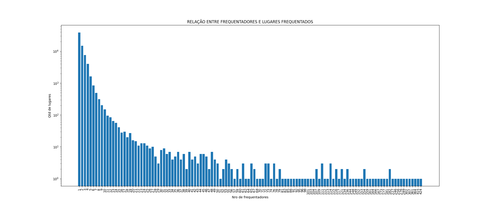

# Processando dados da pesquisa Origem Destino

## Introdução ao Problema

### COVID-19

Os dados de quinta-feira (23/03/2020) indicam 505 mil casos confirmados de contágio e 23 mil mortes por COVID19 em todo o mundo. 
A COVID19 é causada pelo novo coronavírus e é transmitida por meio de gotículas de saliva de pessoa para pessoa. 
Assim, a probabilidade de uma pessoa passar o vírus para outra é muito maior se elas se encontraram presencialmente. 
Para diminuir a taxa de contaminação da doença, a Organização Mundial da Saúde tem indicado que as pessoas no mundo todo se esforcem para diminuir deslocamentos e evitar locais de aglomeração, uma estratégia chamada de “distanciamento social”. 
Foi por este motivo que o CRUESP decidiu que as universidades paulistas deveriam suspender suas aulas.
Aparentemente a epidemia de COVID19 segue um modelo de transmissão chamado de SIR (susceptible, infected, recovered). 
Nesse modelo as pessoas se dividem em três categorias: sucetíveis, infectadas e recuperadas.
Essa última categoria é das pessoas que pegaram o vírus, se recuperaram e estão imunizadas. 
Um [gráfico dinâmico](https://www.washingtonpost.com/graphics/2020/world/corona-simulator/) publicado pelo Washington Post ilustra esse processo de contágio mostrando a evolução exponencial no número de infectados. 
O gráfico mostra a eficácia da estratégia do distanciamento social para achatar a curva do número de contaminado e, assim, dimiuir o impacto de um possível colapso no sistema de saúde.
A simulação publicada no Washington Post representa pessoas se deslocando aleatoriamente em um espaço bidimensional finito. 
Um modelo mais realista deveria considerar o deslocamento real das pessoas pela cidade.

### Pesquisa Origem Destino de São Paulo

A cada 10 anos é realizado uma pesquisa na cidade de São Paulo para avaliar as rotas que os paulistanos fazem pela cidade. 
A última pesquisa Origem/Destino foi realizada em 2017 e entrevistou pessoas em 32 mil domicílios.
Além de coletar dados demograficos das pessoas entrevistadas (idade, faixa de renda etc.), a pesquisa coleta dados sobre suas viagens frequentes:
- Local de origem
- Local de destino
- Pontos de transferência
- Motivo da viagem
- Forma de deslocamento, etc. 

Os dados públicos dessa pesquisa estão disponíveis [aqui](http://www.metro.sp.gov.br/pesquisa-od/).
Com os dados da pesquisa Origem/Destino temos uma melhor aproximação do padrão de encontro de pessoas que moram na região metropolitana de São Paulo. 
Por um lado, é bom lembrar que estamos usando dados amostrais (eles representam menos de 1% da população). 
O número de encontros em nossa simulação será muito menor do que os encontros reais, caso tivéssemos os dados de toda a população. 
Por outro lado, vamos considerar que pessoas que frequentam os mesmos lugares se encontrem mesmo que elas frequentem em horários diferentes ou andares diferentes de um prédio. 
Essas são limitações metodológicas graves, mas julgamos que os dados servem como um bom exercício de programação.

## Tarefa

A primeira tarefa é processar os dados da pesquisa e organizá-los da seguinte forma:
Criar uma classe ou estrutura `Local` com os seguintes atributos: 
- `coordenada x` (inteiro)
- `coordenada y` (inteiro)
- `frequentadores` (arranjo de inteiros)

Os primeiros indicam as coordenadas do lugar, o segundo indica os ids das pessoas que passam por aquele lugar.

Além disso, construir um histograma do número de pessoas que frequentam cada lugar mencionado na pesquisa. 
Ou seja, um gráfico cujo eixo x é a quantidade de lugares e o eixo y o número de pessoas que frequentam
*(quantos lugares são frequentados por um único entrevistado, quantos são frequentados por 2, por 3 e assim por diante)*

## Solução

Decidimos usar a linguagem python pois existem bibliotecas específicas para processamento e plotagem de dados.

Primeiramente utilizamos a biblioteca pandas, para carregar o arquivo `OD_2017.csv` em uma estrutura do pandas chamda `dataframe` e selecionamos apenas as colunas da tabela que nos interessam:

- Coordenadas X e Y da Origem
- Coordenadas X e Y do Destino
- Coordenadas X e Y das Transferências
- ID da Pessoa

E então iteramos sobre as linhas da tabela para criar um `dicionário` (estrutura da linguagem, no formato chave valor), com o seguinte formato:

```json
{
  "x1": {
    "y1": [
      "id1",
      "id2"
    ],
    "y2": [
      "id1",
      "id3"
    ]
  }
}
```

Com essa estrutura formada, podemos iteram sobre os seus itens e fazer uma lista de `Locais` (classe que criamos conforme a especificação da tarefa) e a partir dessa lista contamos o número de frequentadores por local

Uma vez que temos todos os dados necessários, podemos plotar o gráfico com a biblioteca matplotlib:



### Tempo de execução

Em números absolutos, rodando em um computador com a seguinte configuração

- **Sistema Operacional:** Ubuntu 18.04.4 64bits  
- **Memória:** 3,6 GiB
- **Processador:** Intel® Core™ i5-7200U CPU @ 2.50GHz × 4 
- **Placa Gráfica:** Intel® HD Graphics 620 (Kaby Lake GT2)

O tempo de execução é de aproximadamente 45 segundos

Em nossos testes percebemos que a resolução do gráfico influencia bastante no tempo de execução

Pensando em complexidade assintótica, em termos de número de entrevistados **`e`** e número de locais **`l`**, temos os seguintes passos:

- Iteramos uma vez sobre a tabela da pesquisa, que tem **`e`** linhas para construir o dicionário mencionado
- Iteramos sobre esse dicionário que contém os **`l`** locais
- Iteramos sobre a lista de **`l`** locais para plotar o gráfico

Então temos o tempo de **`e + 2l`**, mas em termos de complexidade podemos desprezar a constante **`2`**, então a complexidade é de **`e + l`** 
