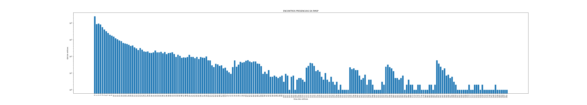

# Construindo um grafo de encontros presenciais da RMSP

## Introdução ao Problema

Um *grafo G* é formado por um *conjunto V* cujos elementos são chamados *nós* ou *vértices* e um *conjunto A* de pares não ordenados de vértices cujos elementos são chamados *arestas*.

Um grafo é uma abstração útil para representar uma série de
problemas matemáticos e de computação: redes sociais, mapas, processos parcialmente ordenadas etc.

Existem três formas de representar um grafo como
uma estrutura de dados: 
1. Como uma lista de pares
2. Como uma matriz
3. Como arranjo de listas ligadas. 

Cada uma dessas representações tem vantagens e desenvantagens em termos de uso de memória e eficiência nas operações básicas de manipulação dessa estrutura de dados: 

- criação de uma nova aresta
- verificação se dois vértices são adjacentes
- iteração em todos os vértices adjacentes a um vértice específico.

## Tarefa

Esta segunda tarefa consiste em construir um grafo cujos nós representem
pessoas entrevistadas na [pesquisa origem/destino de 2017](http://www.metro.sp.gov.br/pesquisa-od/) e uma aresta entre
duas pessoas indique que elas frequentam um mesmo lugar.

Vamos considerara três cenários:

1. Tudo está funcionando normalmente: neste cenário são consideradas  todas as origens e todos os destinos e as arestas são criadas entre quaisquer pessoas que frequentem os mesmos lugares (origem e/ou destinos coincidentes).
2. Locais de aglomeração estão fechados: neste cenário as arestas não incluem trajetos até escolas ou com finalidade de lazer.
3. Apenas serviços essenciais estão abertos: neste cenário as arestas incluem apenas a casa, trajetos com finalidade de saúde e assuntos pessoais.

Cada grupo deve escolher um destes cenários processar a base de dados 
na linaguagem de programação da preferência de vocês e construir o grafo 
usando qualquer dos três modelos de representação 
(matriz, lista de adjacência ou lista de pares). 
Uma vez construído o grafo vocês devem computar o número total de arestas e a distribuição dos graus dos nós 
(ou seja quantas pessoas não encontram ninguém, quantas encontram uma pessoa, duas pessoas etc.).

A entrega consiste de um relatório com uma ou duas páginas em PDF
descrevendo o que foi feito e o histograma dos graus dos nós para o cenário escolhido.

## Solução

Optamos novamente pela linguagem python, pois novamente precisamos plotar dados de maneira semelhante à primeira tarefa.

Escolhemos o cenário **1**, em que tudo está funcionandos.

Primeiramente fizemos nossa implementação de Grafo com a representação em lista de adjacência e métodos úteis, baseado no livro de referência *Algorithms, 4th Edition*, fazendo as alterações necessárias, pois os autores implementam em Java.

As duas maiores diferenças foram a utilização das listas do python, que funcionam como listas ligadas, e a leitura de arquivo.

Para gerar o gráfico, criamos o Grafo a partir do arquivo [OD_graph.txt](OD_graph.txt) que contém as informações necessárias:

- O número de vértices `V`
- O número de arestas (edges) `E`
- Os pares de vértices que representam cada aresta

Para os fazer eixos do grafico, utilizamos os métodos iteramos sobre os vértices do grafo e computamos o grau de cada um com o método `degree()` e com a biblioteca matplotlib geramos o seguinte gráfico:

O gráfico utiliza escala logarítmica devido a grande diferença entre os maiores valores e os menores  