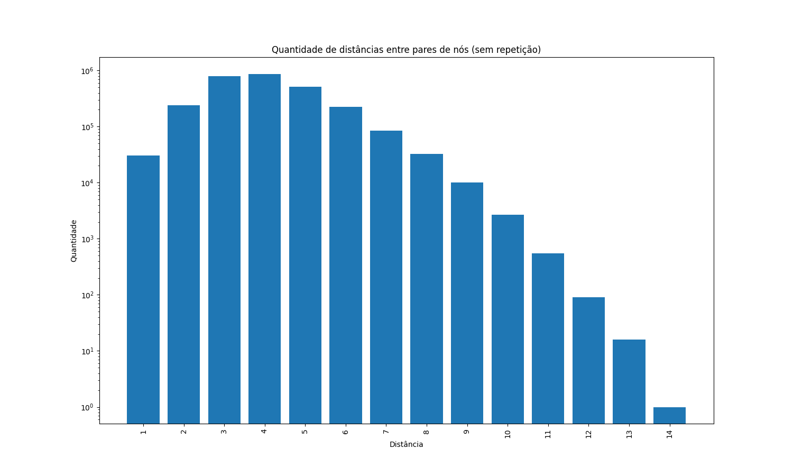

# Diâmetro do Grafo

Escolhemos o **cenário 3**, em que apenas serviços essenciais estão abertos: incluem apenas casa, trajetos com finalidade de saúde e assuntos pessoais.

Foi utilizada a implementação da Busca em Largura para encontrar os caminhos entre todos os vértices `i` e `j`, tais que `i` seja diferente de `j`.

Para cada caminho encontrado,atualizamos um dicionário, no qual cada chave indica a distância do caminho atual e cada valor indica a quantidade de caminhos com a respectiva distância.

Dessa forma, teríamos algo como:

```js
{
  '1': 30, 
  '2': 322, 
  '3': 102, 
  ...
  '14': 1, 
  ...
}
```
Neste exemplo, existem 30 caminhos com distância 1 (ou seja, 30 vértices adjascentes), 322 caminhos de distância 2 e assim por diante.

Após a realização deste processo, foi necessário ordenar o dicionário para que a visualização do gráfico não fosse comprometida. Dicionários em Python, por definição, não são ordenados.

Simultaneamente, foi necessário calcular o diâmetro médio do grafo. Essa conta foi realizada a partir de uma média ponderada das distâncias do grafo.
O diâmetro médio encontrado é de aproximadamente 4 unidades de separação.

Dessa forma, temos o seguinte gráfico que relaciona as distâncias com quantas vezes ela apareceu:



### Tempo de execução

Em números absolutos, rodando em um computador com a seguinte configuração

- **Sistema Operacional:**  Ubuntu 18.04.4 64bits 
- **Memória:** 8,0 GiB
- **Processador:** Intel® Core™ i5-7200U CPU @ 2.50GHz × 4 
- **Placa Gráfica:** Intel® HD Graphics 620 (Kaby Lake GT2)

O tempo de execução é de aproximadamente 60 segundos.

Pensando em complexidade assintótica, em termos de número de vértices **`v`** e número de arestas **`e`**, para o seguinte código:

```python
for i in range(grafo.getV()): 
  bfs = BuscaEmLargura(grafo, i)

  for j in range(grafo.getV()):
    if i != j: 
      pilha = bfs.pathTo(j)

      if pilha != []:
        distancia = pilha.size() - 1

        if distancia in dicio.keys():
          dicio[distancia] += 1
        else:
          dicio[distancia] = 1
```

A complexidade assintótica de realizar a busca em largura para todo par de vértice é proporcional à `V² + E`.

## Alunos

- [Ana Beatriz Machado Cuelbas](https://github.com/anabcuelbas) - 11207881
- [Gabriel de Castro Michelassi](https://github.com/gmichelassi) - 11208162
- [Guilherme Balog Gardino](https://github.com/GuilhermeBalog) - 11270649
- [Laura Zitelli de Souza](https://github.com/LauraZitelli) - 11207814

O repositório está disponivel no GitHub em [https://github.com/gmichelassi/ep-corona-aed2](https://github.com/gmichelassi/ep-corona-aed2)
