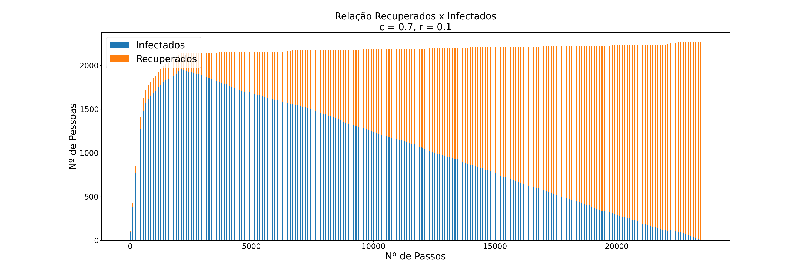

# Contágio SIR

https://docs.google.com/document/d/1M_j2L0M74MpgeoryVjTOvnkSx8pcJcdOh_OI8tOEoCM/edit?usp=sharing

Para contruir uma simulação de contágio do Coronavírus na Região Metropolitana da Cidade de São Paulo, nos basemos no modelo epidemiológico SIR (Susceptible, Infected, Removed), considerando dois paramêtros: a probabilidade de contágio e a probabilidade de recuperação.

A fim de construir um modelo de contágio semelhante ao mencionado acima, utilizamos o terceiro cenário preparado e estudado anteriormente e utilizamos alguns algoritmos explorados em aula.

Primeiramente, ao carregar a componente gigante do grafo dos encontros, todos os vértices foram marcados como suscetíveis (S) e aleatoriamente foi escolhido um vértice inicial (uma pessoa) para ser marcada como infectada (I). Para manter a consistência dos testes, o vértice inicial foi mantido para todos os seguintes testes.

A partir disso, tendo uma pessoa infectada, foi executada uma Busca em Profundidade (*Depth First Search*, DFS) para percorrer todo o grafo, partindo do vértice infectado inicial. Dessa forma, os vértices adjascentes ao mesmo, foram as pessoas que tiveram contato com a infectada, portanto tendo uma certa probabilidade *c* de contágio. Uma pessoa infectada também poderia, eventualmente, se recuperar, com uma dada probabilidade *r*.

O algoritmo funciona da seguinte maneira: 
- Para uma pessoa infectada, primeiro é verificado se ela se recuperou (sorteando um número *0 <= N < 1*, e se *N <= r* ela se recuperou). Neste caso, a contaminação de outras pessoas é impossibilitada.
- Caso contrário, se ela entrou em contato com pessoas suscetíveis a se infectarem, então é verificado se houve o contágio (sorteando um número *0 <= M < 1*, e se *M <= c* a pessoa suscetível se infectou).
- Esse processo de contágio e recuperação é repetido até que não haja mais infectados, ou seja, até que todas as pessoas infectadas se recuperem.

Durante o processo de contágio, é computado o estado atual do algoritmo, salvando o número de pessoas infectadas e recuperadas que havia no momento. Cada estado computado é dito um passo que será utilizado para gerar um gráfico que mostra o desenvolvimento da doença. Nos gráficos (apresentados a seguir) é possível ver como a princípio a doença se espalha rapidamente e, de forma gradual, o número de recuperados começa a crescer ao passo que o número de infectados diminui.

Tomando 3 diferentes pares de parâmetros *c* e *r*, os seguintes resultados foram obtidos:

  

  

  

*Pergunta realizada no enunciado da tarefa: Com os parâmetros c e r fixos, o que deve ocorrer nos diferentes cenários que investigamos?*

Nos cenários com mais pessoas e mais conexões, o número de pessoas infectadas deve ser maior e consequentemente a recuperação de todos levará mais tempo. 

## Alunos

- [Ana Beatriz Machado Cuelbas](https://github.com/anabcuelbas) - 11207881
- [Gabriel de Castro Michelassi](https://github.com/gmichelassi) - 11208162
- [Guilherme Balog Gardino](https://github.com/GuilhermeBalog) - 11270649
- [Laura Zitelli de Souza](https://github.com/LauraZitelli) - 11207814

O repositório está disponivel no GitHub em [https://github.com/gmichelassi/ep-corona-aed2](https://github.com/gmichelassi/ep-corona-aed2)
